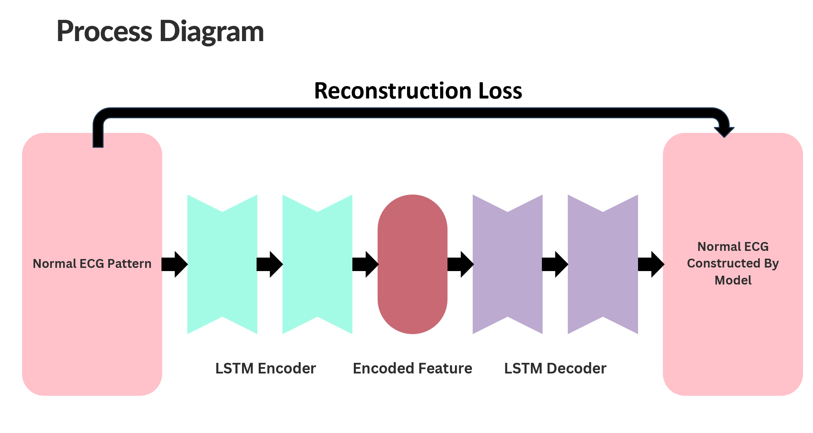

# Univariate Anomaly Analysis in ECG Time Series using LSTM AutoEncoders
- The deep learning model, using LSTM AutoEncoder, automatically extracts features by compressing ECG signals into a latent space and reconstructs them to detect anomalies through reconstruction error.
## Dimensionality Reduction 
- The AutoEncoder compresses high-dimensional ECG data into a lower-dimensional embedding, retaining essential temporal patterns and reducing irrelevant variance.
## Feature Extraction 
- By training on normal samples, the model learns critical features of normal ECG patterns, helping it detect deviations (anomalies) in new samples.
## Model Architecture

## Simulation

